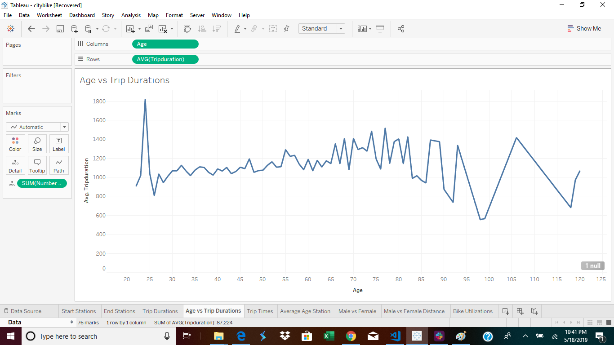
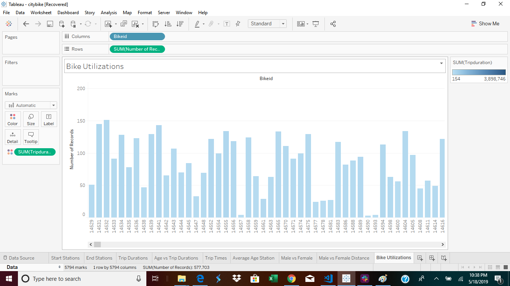
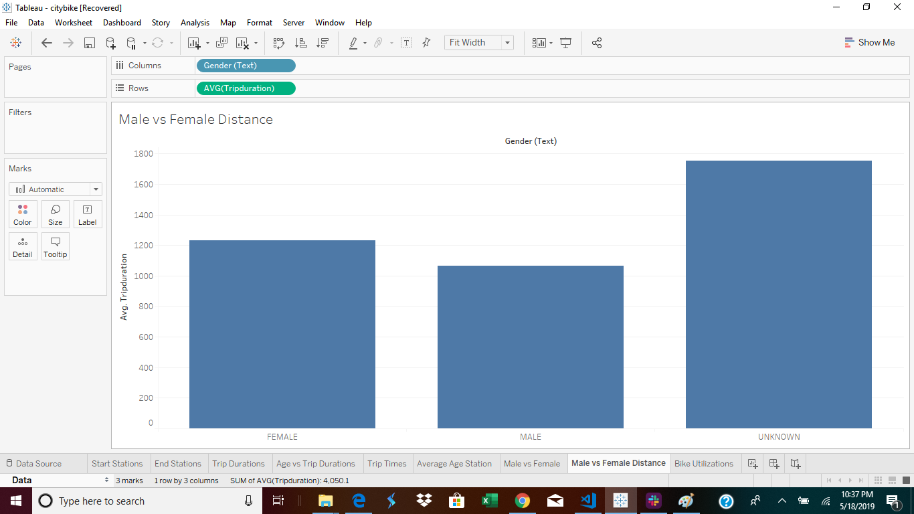
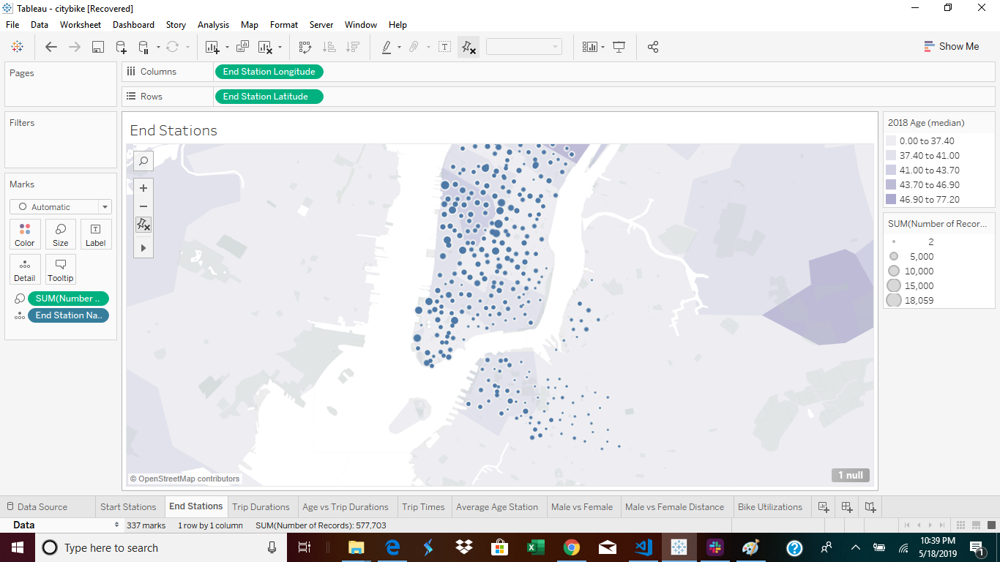
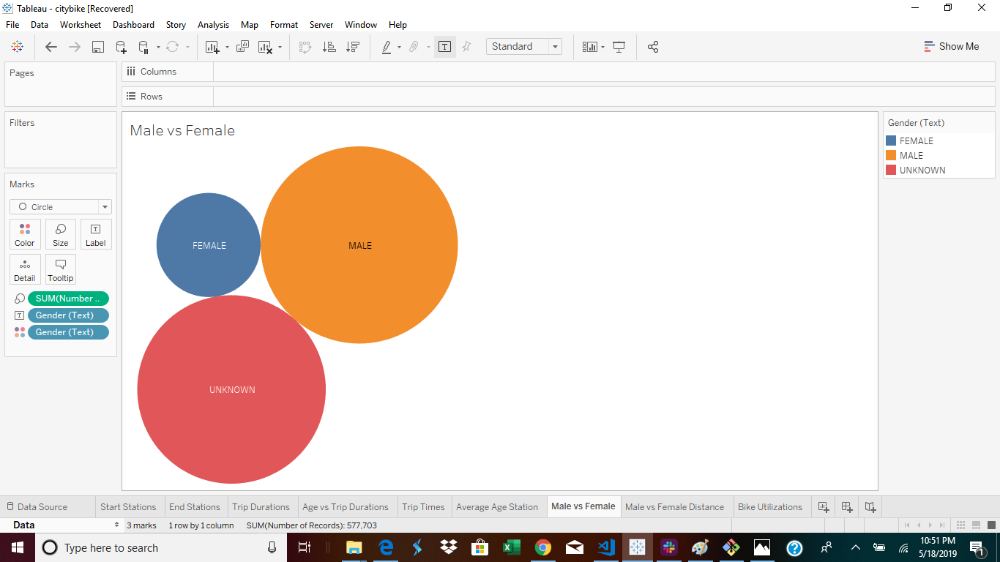
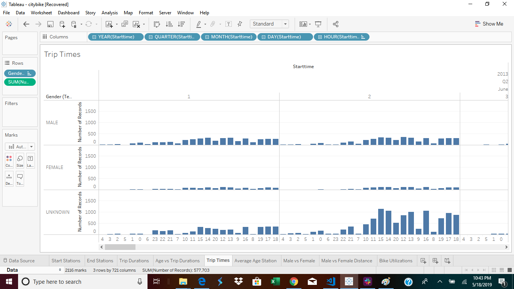
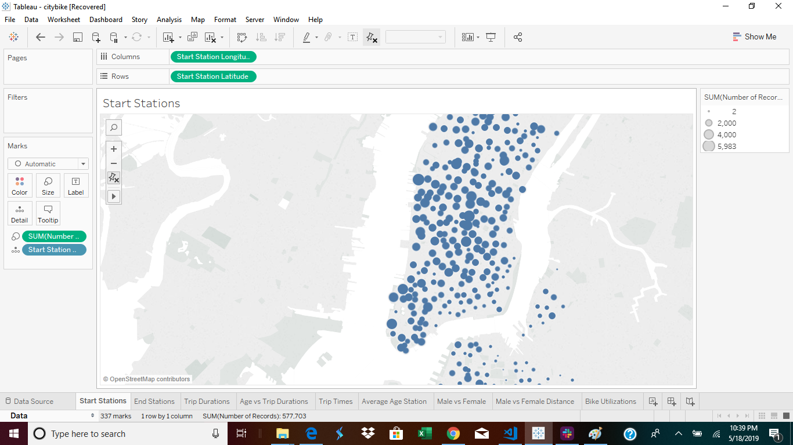
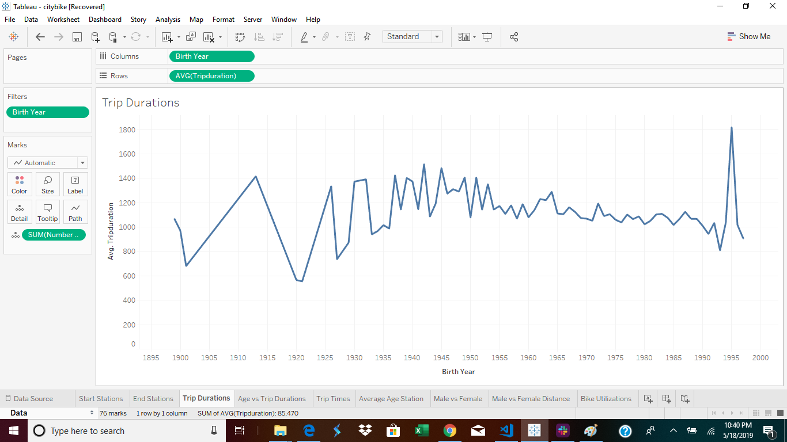

# CityBike-Analysis--Tableau

# Background

As Lead analyst for the New York Citi Bike Program, you are now responsible for overseeing the largest bike sharing program in the United States. In your new role, you will be expected to generate regular reports for city officials looking to publicize and improve the city program.
 
Since 2013, the Citi Bike Program has implemented a robust infrastructure for collecting data on the program's utilization. Through the team's efforts, each month bike data is collected, organized, and made public on the Citi Bike Data webpage: https://www.citibikenyc.com/system-data

However, while the data has been regularly updated, the team has yet to implement a dashboard or sophisticated reporting process. City officials have a number of questions on the program, so your first task on the job is to build a set of data reports to provide the answers.

# Analysis

How many trips have been recorded total during the chosen period?

* 5,029,334 rides combined for July 2016, 2017 and 2018

By what percentage has total ridership grown?

* Ridership has grown for the month of July year over year from 2016 to 2017 by 7.07% and from 2017 to 2018 by 3.54% respectively
How has the proportion of short-term customers and annual subscribers changed?

* While short-term customer ridership has grown very minimally (July 2016 to 2017 by 1.19% and July 2017 to 2018 by 0.46%), annual subscribers have grown by 5.88% and 3.07% since 2016 to 2018 with a total growth of almost 9% over the chosen period (month of July)
What are the peak hours in which bikes are used?

* Not surprisingly the most popular hours were at 8:00am and 5:00pm/6:00pm which correlate to rush hours for the morning and evening commuters

Today, what are the top 10 stations in the city for starting a journey? (Based on data, why do you hypothesize these are the top locations?)

* Pershing Square North
* West St & Chambers St
* 12th Ave & W. 40th St
* E 17th St & Broadway
* W 21st St & 6th Ave
* Broadway & E 22nd St
* W 20th St & 11th Ave
* Central Park S & 6th Ave
* Broadway & E 14th St
* South End Ave & Liberty St.
 
 
Based on the data of bike stations in the city for starting a journey the above locations are top 10 because they are near major transportation hubs (MTA stations), and also near bike routes (i.e. Central Park, Westside Highway) which are popular amongst riders
Today, what are the top 10 stations in the city for ending a journey? (Based on data, why?)

* Pershing Square North
* West St & Chambers St
* 12th Ave & W. 40th St
* E 17th St & Broadway
* W 21st St & 6th Ave
* Broadway & E 22nd St
* W 20th St & 11th Ave
* Carmine St & 6th Ave
* South End Ave & Liberty St
* Broadway & E 14th St
* The top 10 end vs. start stations are the same with the exception of Carmine St & 6th Ave and Central Park S & 6th Ave. However * * * Carmine St & 6th Ave is also near a park (Washington Square Park)

Today, what are the bottom 10 stations in the city for starting a journey? (Based on data, why)

* The bottom 10 stations for starting a journey are either at NYC bus stations or in Brooklyn, and outside of Manhattan, which has th largest concentration of bike stations

Today, what are the bottom 10 stations in the city for ending a journey (Based on data, why?)

* The bottom 10 stations for ending a journey are also similar to the bottom 10 stations in the city for starting a journey
Today, what is the gender breakdown of active participants (Male v. Female)?

As of July 2018 there are:
* 64.93% Male
* 24.05% Female
* 11.02% Unknown

How effective has gender outreach been in increasing female ridership over the timespan?

* Female ridership has increased year over year but male ridership still far outpaces all genders

How does the average trip duration change by age?

* In 2016 the average ages for trip durations was relatively steady, meaning that across all ages trip durations were quite similar
* In 2017 there are stark noticable differences in that 32, 21 and 24 year olds comprised the top 3 ages for longest trip durations
* In 2018 the top 3 ages shift to 50, 18 and 42 year olds with the longest trip durations

What is the average distance in miles that a bike is ridden?
Which bikes (by ID) are most likely due for repair or inspection in the timespan?

* There are 12 bikes that are have been ridden over 4 million seconds (over 1,000 hours) that are at the highest risk of repair or inspection, and 4 bikes that have surpassed over 6 million seconds (1,666 hours)

# Report

#### Visualizations

.

